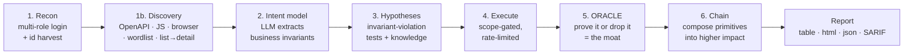

<div align="center">

# 🔥 HERETIC

### Autonomous AI agent that finds **business-logic vulnerabilities**

*The bug class scanners can't touch — and human pentesters still find by hand.*


[**Quickstart**](#-quickstart-60-seconds) · [**Install**](#-install) · [**Commands**](#-command-reference) · [**Config**](#-configuration) · [**Bug classes**](#-what-it-finds) · [**How it works**](#-how-it-works) · [**Safety**](#-safety--legal) · [**FAQ**](#-faq)

</div>

---

> **Heretic** *(n.)* — one who breaks the sacred rules.
> This tool breaks the rules an application **assumes** but never **enforces**.

HERETIC is a **CLI tool** (in the spirit of `nmap`, `sqlmap`, `nuclei`) that reasons about an app's *business intent*, then systematically tries to violate it: **IDOR/BOLA, broken function-level auth, excessive data exposure, price tampering, workflow bypass, mass assignment, race conditions.**

It is **not** another signature scanner. Signature scanners find XSS / SQLi / CVEs. HERETIC finds the **~70% of critical web bugs that have no signature** — where the code did exactly what it was told, but *what it was told* violated the business rules. It reasons about intent with an LLM, but **never trusts the LLM to confirm a bug** — a deterministic **Oracle** proves every finding, which is why the false-positive rate is ~0%.

```bash
heretic scan -u https://target.local --roe roe.yaml --accounts accounts.yaml
```

---

## 👀 See it work — real output, live OWASP Juice Shop

Not a mock-up. This is HERETIC against a live `bkimminich/juice-shop` container — model auto-detected, basket id harvested from the login response, attack surface discovered from the SPA's JS bundle.

```text
  CONFIRM excessive_data_exposure — basketitem list leaks all users' records
  CONFIRM bfla — admin function /rest/admin/application-configuration is exposed to unauthenticated users
  CONFIRM mass_assignment — registration at /api/Users accepts privileged field 'role'
  CONFIRM price_tamper — /api/BasketItems accepts a negative quantity (-100)
  CONFIRM workflow_bypass — order finalized at /rest/basket/6/checkout without a payment step
────────────────── 7 confirmed · 17 dropped (false positives) ───────────────────
```

Five business-logic classes confirmed on a live app in **one command** — with **0 false positives**. The 17 "dropped" are candidates the Oracle *refused* to confirm (SPA catch-alls, public catalogs, the LLM's wrong guesses). Every confirmation is deterministic and reproducible.

It even **catches itself hallucinating** — when the LLM invents an endpoint that isn't on the target, HERETIC detects it and regenerates grounded on the real surface:

```text
Phase 3b hypotheses — logic classes (LLM + knowledge)
  ⚠ hallucination detected — 1/3 test(s) referenced endpoints not on the real surface (33%); regenerating grounded
  ✓ self-corrected — added 3 grounded test(s)
```

---

## 📋 Table of contents

- [Install](#-install)
- [Quickstart (60 seconds)](#-quickstart-60-seconds)
- [The three ways to run it](#-the-three-ways-to-run-it)
- [Command reference](#-command-reference)
- [Choosing an AI model](#-choosing-an-ai-model)
- [Configuration](#-configuration)
- [What it finds (bug classes)](#-what-it-finds)
- [How it works](#-how-it-works)
- [Output & reporting](#-output--reporting)
- [Run it in CI](#-run-it-in-ci)
- [Safety & legal](#-safety--legal)
- [FAQ](#-faq)
- [Docs](#-full-documentation)

---

## 📦 Install

**Requirements:** Python **3.11+**. An AI key is *optional* (see [models](#-choosing-an-ai-model)) — HERETIC runs the deterministic classes with no key at all.

<table>
<tr><th>Method</th><th>Command</th><th>When</th></tr>
<tr><td><b>pipx</b> (recommended)</td><td><code>pipx install heretic-agent</code></td><td>Global CLI, isolated env</td></tr>
<tr><td><b>pip</b> (from source)</td><td><code>pip install -e ".[dev]"</code></td><td>Hacking on it / running tests</td></tr>
<tr><td><b>Docker</b></td><td><code>docker build -t heretic . && docker run --rm heretic --help</code></td><td>Zero local Python setup</td></tr>
</table>

**Optional extras** (install only what you need):

```bash
pip install -e ".[browser]"    # headless-browser XHR capture (Playwright) — for JS-heavy SPAs
pip install -e ".[gemini]"     # the gemini-flash backend
pip install -e ".[rag]"        # swap keyword knowledge store for embeddings (ChromaDB)
```

Verify the install:

```bash
heretic version
heretic bench      # offline self-test — no network, no API key. Should report FP-rate 0%.
```

---

## ⚡ Quickstart (60 seconds)

**The easy path — no config files to write.** Point it at your app, give it two logins, done:

```bash
heretic connect
```

`connect` will:
1. Ask for the **target URL** and **two test accounts**.
2. **Auto-detect the login endpoint** and where the token lives in the response (handles OTP / MFA / SSO — just paste a bearer token when prompted).
3. **Auto-detect your AI model** — a hosted key or a local Ollama model, whichever is best available.
4. **Discover the attack surface**, run the scan, and print confirmed findings.

Or launch the full interactive menu:

```bash
heretic          # menu: Connect · Auto · Doctor · Scan · Models · Keys …
```

> 💡 **No AI key and no Ollama?** It still runs — the deterministic classes (**BOLA**, **BFLA**, **data-exposure**) need no LLM and never change state. You get real findings offline.

---

## 🚀 The three ways to run it

Pick the entry point that matches how much control you want:

### 1. Guided — `heretic connect` / `heretic auto`
Zero config. Best for a first run or a quick look at an app.

```bash
heretic auto -u https://target.local --profile targets/crapi
```
Runs the whole assessment end-to-end (every class + chaining) and writes an HTML report.

### 2. Full control — `heretic scan`
The scriptable workhorse. You supply `roe.yaml` + `accounts.yaml` and choose exactly what runs.

```bash
heretic scan -u https://target.local --roe roe.yaml --accounts accounts.yaml \
  --discover --chain --iterate 3 --report findings.html
```

### 3. Score it — `heretic livecheck`
Run against a *known* target and grade precision / recall / FP vs ground truth. This is how you prove the tool works.

```bash
heretic livecheck --profile targets/juiceshop -u http://localhost:3000
```

---

## 🧭 Command reference

Every command. Run `heretic <command> --help` for the full flag list.

| Command | What it does |
|---------|--------------|
| `heretic` | Launch the interactive menu (logo + guided actions) |
| `heretic connect` | **Guided setup** — enter a URL + 2 users, auto-detect login, scan |
| `heretic auto` | **One-command** guided scan → HTML report (auto-detects everything) |
| `heretic scan` | **Full CLI scan** — the main command (see flags below) |
| `heretic init` | Scaffold starter `roe.yaml` + `accounts.yaml` in the current dir |
| `heretic doctor` | Preflight — are your model key(s) set and the target reachable? |
| `heretic bench` | Offline benchmark (no network / no key) — scores precision/recall/FP |
| `heretic livecheck` | Run a profile vs a real target and grade it against ground truth |
| `heretic resume` | Resume a saved engagement (`scan --save`) after an interruption |
| `heretic export` | Turn confirmed attack traces into a fine-tune dataset |
| `heretic version` | Print version |

### `heretic scan` — every flag

```bash
heretic scan -u <URL> --roe <roe.yaml> --accounts <accounts.yaml> [options]
```

| Flag | Default | Purpose |
|------|---------|---------|
| `-u, --url` | *(required)* | Target base URL |
| `--roe` | *(required)* | Rules-of-engagement YAML (scope + authorization gate) |
| `--accounts` | *(required)* | Test-account YAML |
| `--model` | `auto-detect` | Backend id, or `auto` for per-phase routing ([models](#-choosing-an-ai-model)) |
| `--classes` | *all* | Comma list, e.g. `bola,price_tamper` ([classes](#-what-it-finds)) |
| `--mode` | `dry-run` | `dry-run` (read-only) or `live` (allows state-changing tests) |
| `--discover / --no-discover` | *on if no `objects:`* | Autonomously find endpoints + infer BOLA targets |
| `--brute` | off | Also brute-force a path wordlist during discovery (noisy) |
| `--browser` | off | Headless-browser XHR capture (needs Playwright) |
| `--chain` | off | Compose confirmed primitives into higher-impact chains |
| `-i, --iterate <N>` | `0` | On a failed logic test, mutate the input and retry up to N times |
| `--save <file.db>` | — | Checkpoint engagement to SQLite (survives Ctrl-C → `resume`) |
| `--log <file.jsonl>` | — | Append an audit trace (also used for fine-tune export) |
| `--memory <file.jsonl>` | — | Learn from + improve across runs |
| `--report <file.html>` | — | Write an HTML report |
| `--sarif <file.sarif>` | — | Write SARIF 2.1.0 (GitHub/GitLab code scanning) |
| `--fail-on <sev>` | — | Exit non-zero if a finding ≥ `info\|low\|medium\|high\|critical` (CI gate) |
| `-o, --output` | `table` | `table` \| `json` \| `md` |

<details>
<summary><b>Copy-paste recipes</b></summary>

```bash
# First run against an app you have no config for — let it discover everything
heretic scan -u https://app.local --roe roe.yaml --accounts accounts.yaml --discover

# Only the read-only classes (safe on production, no LLM key needed)
heretic scan -u https://app.local --roe roe.yaml --accounts accounts.yaml \
  --classes bola,bfla,excessive_data_exposure

# Full assessment with chaining, retries, resumable checkpoint + HTML report
heretic scan -u https://app.local --roe roe.yaml --accounts accounts.yaml \
  --discover --chain --iterate 3 --save run.db --report findings.html

# JS-heavy Angular/React SPA — capture the runtime XHRs a static scrape misses
heretic scan -u https://spa.local --roe roe.yaml --accounts accounts.yaml --browser

# Resume after an interruption
heretic resume --engagement run.db --report findings.html

# CI gate — fail the build on any HIGH+ finding, emit SARIF
heretic scan -u https://staging.local --roe roe.yaml --accounts accounts.yaml \
  --classes bola,bfla,excessive_data_exposure --sarif heretic.sarif --fail-on high
```
</details>

---

## 🤖 Choosing an AI model

HERETIC talks to any **OpenAI-compatible** endpoint over plain HTTP (no vendor SDK). It **auto-detects** the best model available — a hosted key or a local Ollama model — so you usually don't pass `--model` at all.

| `--model` id | Backend | Key env var | Notes |
|--------------|---------|-------------|-------|
| `nemotron-super` | NVIDIA (free API) | `NVIDIA_API_KEY` | **Recommended** default brain |
| `nemotron-nano` | NVIDIA (free API) | `NVIDIA_API_KEY` | Cheap workhorse |
| `gemini-flash` | Google Gemini | `GEMINI_API_KEY` | 1M context (`pip install -e ".[gemini]"`) |
| `groq` | Groq (Llama 3.3 70B) | `GROQ_API_KEY` | Fast |
| `openrouter-r1` | OpenRouter (DeepSeek-R1 free) | `OPENROUTER_API_KEY` | Diverse 2nd opinion for the refuter panel |
| `ollama:<model>` | **Local Ollama** | *(none)* | **Fully private** — nothing leaves the box |
| `auto` | Per-phase routing | — | Big model for intent/judge, small for the rest |
| `fake` | Scripted (offline) | *(none)* | No LLM — deterministic classes only |

**Set a key** (any one is enough) via env var or a `.env` file in the working directory:

```bash
# .env  (auto-loaded, gitignored — never commit keys)
NVIDIA_API_KEY=nvapi-xxxxxxxx
```

**Go fully offline / private** with a local model:

```bash
ollama pull qwen2.5:7b      # or any model; HERETIC auto-selects the largest local one
heretic scan ...            # --model omitted → uses your local model, no data leaves the host
```

Check what's wired up before a run:

```bash
heretic doctor -u https://target.local
```

---

## ⚙️ Configuration

You need **two files**. Generate starters with `heretic init`, then edit.

### 1. `roe.yaml` — Rules of Engagement (the authorization gate)

HERETIC **refuses to run** without a valid, signed RoE. This is a hard security boundary — the LLM cannot override it.

```yaml
engagement:    "my lab engagement"        # free-text label
authorized_by: "you@example.com"          # REQUIRED — who authorized this test
signed:        true                        # REQUIRED — must be true or it refuses to run

scope:
  allow:                                   # every request target MUST match one of these
    - "*.target.local"
    - "127.0.0.1"
    - "10.0.0.0/8"                         # CIDR ranges supported
  exclude:                                 # never touch these, even if in allow
    - "*/admin/delete*"

mode:          dry-run                      # dry-run (read-only) | live (allows state changes)
max_rate_rps:  5                            # request rate cap — don't DoS the target
max_parallel:  3                            # concurrency cap for race-condition tests

destructive_allowed: []                     # e.g. ["price_tamper"] or ["*"] to fire state-changing tests
classes: [bola, bfla, excessive_data_exposure]   # omit for all classes

# Optional: a header sent on EVERY request (e.g. bug-bounty program attribution)
# headers:
#   X-Bug-Bounty: "your-handle"

# Objects to harvest ids from + test for BOLA (omit entirely to auto-discover):
objects:
  - name:      order
    list_url:  "/api/orders"               # each role fetches its OWN orders (harvest ids)
    item_url:  "/api/orders/{id}"          # non-owners are tested against this (cross-role BOLA)
    id_field:  "id"                         # the id key inside each list item
    # list_path: "data"                     # dotted path to the array, if nested
```

<details>
<summary><b>Advanced RoE blocks — <code>login_objects</code>, <code>races</code>, per-phase <code>models</code></b></summary>

```yaml
# When the owned id comes from the LOGIN response, not a list endpoint
# (e.g. Juice Shop hands you your basket id at login):
login_objects:
  - name:     basket
    item_url: "/rest/basket/{id}"
    id_from:  "authentication.bid"          # dotted path in the login JSON

# Race / TOCTOU probes — fire N identical requests, confirm no more than
# `expect_max_success` succeed (e.g. a single-use coupon applied twice):
races:
  - name:     coupon_double_apply
    url:      "/api/coupon/apply"
    method:   POST
    body:     { code: "SAVE10" }
    as_role:  userA
    parallel: 10
    expect_max_success: 1

# Per-phase model routing (only used with `--model auto`):
models:
  intent:     nemotron-super
  hypothesis: ollama:nemotron-nano
  judge:      nemotron-super
  refute:     openrouter-r1
```
</details>

### 2. `accounts.yaml` — test identities (operator-owned only)

HERETIC uses **multiple roles at once** for differential (cross-session) testing — that's how it proves BOLA.

```yaml
login:
  url:         "/api/auth/login"
  method:      "POST"
  token_field: "token"                       # json field · dotted "data.token" · or "cookie:session"
  auth_header: "Authorization: Bearer {token}"

roles:
  - { name: guest, creds: null }                                               # unauth baseline
  - { name: userA, creds: { email: "userA@test.local", password: "Pass123!" } }
  - { name: userB, creds: { email: "userB@test.local", password: "Pass123!" } }  # the "victim" for BOLA
  - { name: admin, creds: { email: "admin@test.local", password: "Admin123!" } }
```

> 🔑 **OTP / MFA / SSO?** You can't script those logins — so paste a token instead. Give the role a `token:` field with a bearer token grabbed from your browser, and HERETIC skips login for that identity:
> ```yaml
>   - { name: userA, token: "eyJhbGciOi..." }
> ```

> ⚠️ `accounts.yaml` holds credentials — it's **gitignored** by default. Never commit it, never use real end-user data.

---

## 🎯 What it finds

| Class | `--classes` id | What it catches | Oracle | Changes state? |
|-------|----------------|-----------------|--------|:---:|
| **BOLA / IDOR** | `bola` | One user reading another's object | Cross-session differential | No ✅ |
| **Broken function-level auth** | `bfla` | Admin function reachable by a lower role | Function-level access diff | No ✅ |
| **Excessive data exposure** | `excessive_data_exposure` | A list leaking other users' / secret data | Owner co-mingling | No ✅ |
| **Price tampering** | `price_tamper` | Server trusting a client-supplied price/qty | Invariant assertion | Yes ⚠️ |
| **Mass assignment** | `mass_assignment` | Registration accepting a privileged field | Reflected-field assertion | Yes ⚠️ |
| **Workflow bypass** | `workflow_bypass` | Finalizing without a prerequisite step | State-delta judge (+ refuter panel) | Yes ⚠️ |
| **Race / TOCTOU** | `race_condition` | Non-atomic check-then-act (double-spend) | Parallel-fire success count | Yes ⚠️ |
| *Coupon abuse* | `coupon_abuse` | *Reusing single-use limits (experimental, LLM-driven)* | State-delta | Yes ⚠️ |
| *Auth-flow abuse* | `auth_flow` | *Auth sequence violations (experimental)* | — | — |

**✅ read-only classes** are safe to run against production — no LLM key required, no state changed.
**⚠️ state-changing classes** are **gated**: they only fire in `--mode live` **and** when listed in the RoE's `destructive_allowed`. In `dry-run` they're skipped and the tool tells you why.

---

## 🧠 How it works

The LLM **proposes**; deterministic code **enforces and confirms**. That split is the whole design — an LLM is great at guessing where a logic bug might be, and terrible at being trusted that one happened.



- **Recon** logs in as every role and harvests the ids each one owns.
- **Discovery** finds the attack surface itself — parses OpenAPI/Swagger, extracts API routes from SPA JS bundles, optionally drives a headless browser to capture runtime XHRs, and follows list endpoints to real item endpoints (`/thing/{id}`) — so you don't hand-write `objects:`.
- **Intent model** (LLM) reads the observed API and writes down the business rules it *should* enforce.
- **Hypotheses** turn each invariant into a concrete test. Invented endpoints are detected and regenerated against the real surface ([anti-hallucination](docs/09-LIVE-VALIDATION.md)).
- **Oracle** is the moat: a business-logic bug throws no error and returns `200 OK`, so the Oracle *proves* an invariant was violated — deterministically where possible, and with an adversarial 3-skeptic refuter panel for the LLM-judged classes. **An LLM can never veto a deterministic proof.**
- **Chain** composes confirmed primitives (e.g. two BOLA reads → bulk exfiltration).

Full detail: [`docs/01-ARCHITECTURE.md`](docs/01-ARCHITECTURE.md) · [`docs/03-ORACLE.md`](docs/03-ORACLE.md) · [`docs/02-WORKFLOWS.md`](docs/02-WORKFLOWS.md).

---

## 📤 Output & reporting

| Format | How | Use |
|--------|-----|-----|
| **Terminal table** | *(default)* | Live view while it runs |
| **JSON** | `-o json` | Pipe into other tools |
| **Markdown** | `-o md` | Paste into a report / ticket |
| **HTML** | `--report findings.html` | Shareable, self-contained report |
| **SARIF 2.1.0** | `--sarif out.sarif` | GitHub / GitLab / Azure code scanning |

Every finding carries a **proof bundle**: the oracle used, the evidence (status codes, body similarity, distinct owners, …), a reproducible **PoC** request sequence, a confidence score, and a remediation.

---

## 🔁 Run it in CI

Because every finding is Oracle-proven (~0 FP), a failing build is a **real bug, not AI noise** — the property that makes a security gate developers keep switched on.

```yaml
# .github/workflows/heretic.yml
- uses: SYCO7/heretic@v0.1.0
  with:
    url: https://staging.example.com
    roe: roe.yaml
    accounts: accounts.yaml
    classes: bola,bfla,excessive_data_exposure   # read-only set — safe on every PR, no LLM key
    fail-on: high
- uses: github/codeql-action/upload-sarif@v3
  with: { sarif_file: heretic.sarif }
```

The read-only classes need no LLM key and never change state, so they're safe on every PR. Run the state-changing classes on a schedule against staging. See [`docs/CI.md`](docs/CI.md).

---

## 🛡️ Safety & legal

HERETIC is built for **authorized testing only** and enforces it in code:

- **Authorization gate** — refuses to run without a signed RoE naming who authorized the test.
- **Scope allowlist** — *every* request is checked against `scope.allow` (host globs + CIDR) **before it leaves the process**; anything out of scope or matching `exclude` is hard-blocked. The LLM cannot bypass this.
- **Read-only by default** — `dry-run` mode does no state changes. State-changing classes fire **only** in `live` mode **and** when explicitly listed in `destructive_allowed`.
- **Rate limited** — `max_rate_rps` / `max_parallel` throttle every identity so you don't stress the target.

Only test systems you own or are explicitly authorized to assess. See [`docs/07-GUARDRAILS.md`](docs/07-GUARDRAILS.md).

---

## ❓ FAQ

<details>
<summary><b>Do I need an API key?</b></summary>

No. The deterministic classes (**BOLA**, **BFLA**, **excessive-data-exposure**) run with no LLM at all. A key (or a local Ollama model) unlocks the reasoning-driven classes (price/workflow/mass-assignment). `heretic bench` self-tests with zero keys.
</details>

<details>
<summary><b>Will it break my app or delete data?</b></summary>

In the default `dry-run` mode, no — it's read-only. State-changing tests are double-gated behind `--mode live` **and** the RoE's `destructive_allowed` list, and even then are scoped to your test accounts and rate-limited.
</details>

<details>
<summary><b>It found nothing / login failed.</b></summary>

Run `heretic doctor -u <url>` to check reachability and keys. If login failed, confirm the credentials in `accounts.yaml` and that the login endpoint/token field auto-detected correctly — or set them explicitly. For OTP/MFA/SSO, paste a bearer `token:` on the role instead of `creds:`.
</details>

<details>
<summary><b>How do I keep everything private / offline?</b></summary>

Use a local model: `ollama pull qwen2.5:7b`, then run without `--model`. Nothing leaves the host — the LLM calls go to `localhost`.
</details>

<details>
<summary><b>How do I prove it actually works?</b></summary>

`heretic bench` (offline) and `heretic livecheck --profile targets/<name> -u <url>` (live, scored against ground truth). Validated on **crAPI**, **OWASP Juice Shop**, and **VAmPI** — 3 different BOLA mechanisms, 0 false positives each. See [`docs/09-LIVE-VALIDATION.md`](docs/09-LIVE-VALIDATION.md).
</details>

---

## 📚 Full documentation

| # | Doc | What |
|---|-----|------|
| 0 | [`docs/00-VISION.md`](docs/00-VISION.md) | Problem, thesis, the moat |
| 1 | [`docs/01-ARCHITECTURE.md`](docs/01-ARCHITECTURE.md) | Components, data flow, tech stack |
| 2 | [`docs/02-WORKFLOWS.md`](docs/02-WORKFLOWS.md) | Phase workflow + flowcharts |
| 3 | [`docs/03-ORACLE.md`](docs/03-ORACLE.md) | The hard part — verification / FP kill |
| 4 | [`docs/04-LLM-BACKENDS.md`](docs/04-LLM-BACKENDS.md) | Model analysis + free AI options |
| 6 | [`docs/06-USAGE.md`](docs/06-USAGE.md) | Deeper usage guide |
| 7 | [`docs/07-GUARDRAILS.md`](docs/07-GUARDRAILS.md) | Scope, safety, legal |
| 9 | [`docs/09-LIVE-VALIDATION.md`](docs/09-LIVE-VALIDATION.md) | Reproduce the live runs, score recall/FP |
| ★ | [`docs/CI.md`](docs/CI.md) | Run in CI — SARIF + GitHub Action |

---

## 🤝 Contributing & license

Issues and PRs welcome. Run the suite before pushing:

```bash
make test      # pytest
make bench     # offline FP-gate
make lint      # ruff
```

**License:** [Apache-2.0](LICENSE). Lab-first — authorized testing only.

<div align="center">

**Built by [SYCO7](https://github.com/SYCO7)**

*If HERETIC finds you a bug, ⭐ the repo.*

</div>
