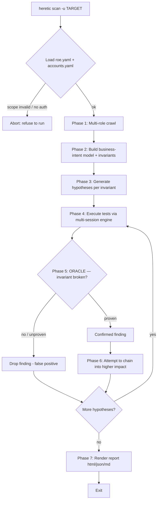
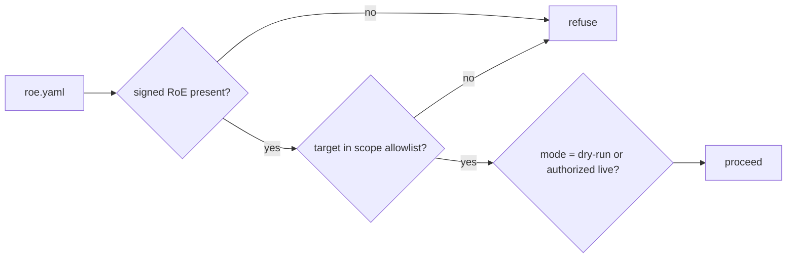
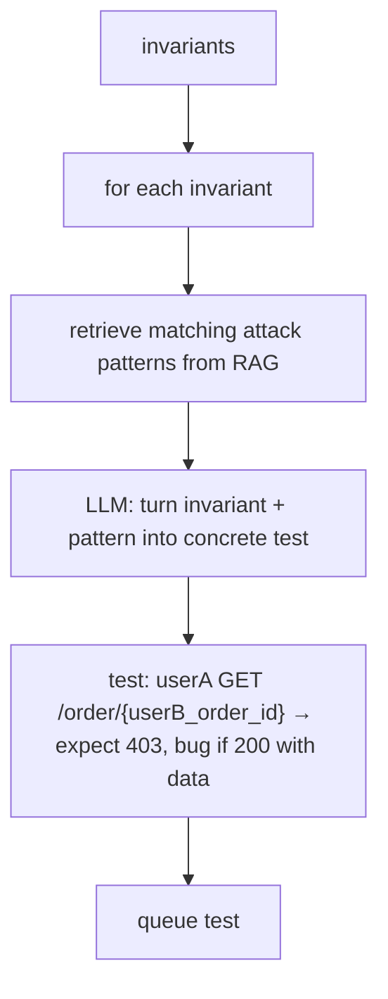
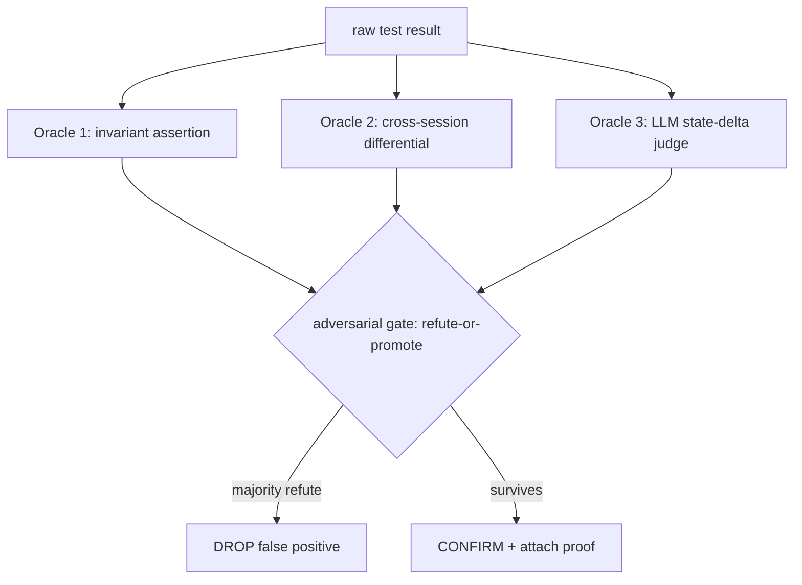
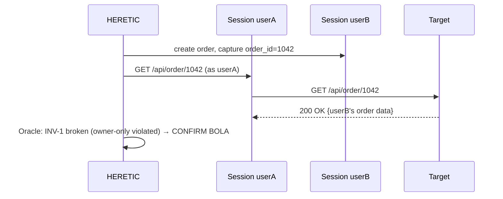

# 02 — Workflows & Flowcharts

## The core loop

HERETIC's engine is a phase state machine: **Recon → Model → Hypothesize → Test → Verify → Chain → Report.** It is not strictly linear — the orchestrator loops back (e.g. a verified finding spawns new hypotheses for chaining).

## Master flowchart



## Phase detail

### Phase 0 — Scope & authorization gate

- Enforced **before every action**, not just at start. See [`07-GUARDRAILS.md`](07-GUARDRAILS.md).

### Phase 1 — Multi-role recon
- Playwright crawls target once **per role** (guest, userA, userB, admin).
- Captures: endpoints, methods, params, request/response bodies, cookies/tokens, visible object IDs, workflow sequences.
- Output: normalized site map + per-role session objects.

### Phase 2 — Business-intent model (the "understanding" step)
- Feed the whole crawled map to a **large-context LLM** (Nemotron 3 / Gemini — both 1M ctx).
- Model outputs structured JSON:
```json
{
  "app_type": "e-commerce API",
  "entities": ["user", "order", "product", "coupon", "wallet"],
  "roles":    ["guest", "user", "admin"],
  "workflows": [
    {"name": "checkout", "steps": ["add_cart", "apply_coupon", "pay", "ship"]}
  ],
  "invariants": [
    {"id": "INV-1", "rule": "order is readable only by its owner",        "class": "bola"},
    {"id": "INV-2", "rule": "price is computed server-side from catalog",  "class": "price_tamper"},
    {"id": "INV-3", "rule": "a coupon is redeemable once per user",        "class": "coupon_abuse"},
    {"id": "INV-4", "rule": "shipping requires a completed payment",       "class": "workflow_bypass"},
    {"id": "INV-5", "rule": "a user cannot set their own role/balance",    "class": "mass_assignment"}
  ]
}
```
- **Invariants are the heart.** Everything downstream is "try to break invariant X, then prove it broke."

### Phase 3 — Hypothesis generation

- RAG corpus: OWASP WSTG, PortSwigger logic labs, HackTricks, prior findings.
- Each hypothesis carries its **expected-safe outcome** — this is what the Oracle checks against.

### Phase 4 — Test execution
- Multi-session engine replays the test's request sequence.
- For differential tests, fires the *same* request as multiple identities.
- Calls `bugbounty-mcp` tools where they fit (`idor_test`, `race_condition_test`, etc.).
- Captures full request/response per identity + any state deltas.

### Phase 5 — Oracle (verification) — see [`03-ORACLE.md`](03-ORACLE.md)


### Phase 6 — Chaining
- Verified primitives are fed back to the LLM: "given IDOR on /order and mass-assignment on /profile, construct a higher-impact chain."
- Example: IDOR (read others' data) + mass-assignment (`is_admin:true`) → full account takeover.
- New chained hypotheses re-enter Phase 4.

### Phase 7 — Report
- Renders each confirmed finding: title, invariant broken, severity (CVSS-ish), reproducible PoC (exact requests), business impact, remediation.
- Formats: `--report out.html`, `-o json`, `-o md`.

## Sequence view (multi-session differential — the signature move)



## State machine (orchestrator)

```
   ┌─────┐   ┌───────┐   ┌───────────┐   ┌──────┐   ┌────────┐   ┌───────┐   ┌────────┐
   │SCOPE│──▶│ RECON │──▶│ INTENT    │──▶│ HYPO │──▶│ EXECUTE│──▶│ ORACLE│──▶│ REPORT │
   └─────┘   └───────┘   │ MODEL     │   └──────┘   └────────┘   └───┬───┘   └────────┘
                         └───────────┘       ▲                       │
                                             │      confirmed→chain  │
                                             └───────────────────────┘
```
