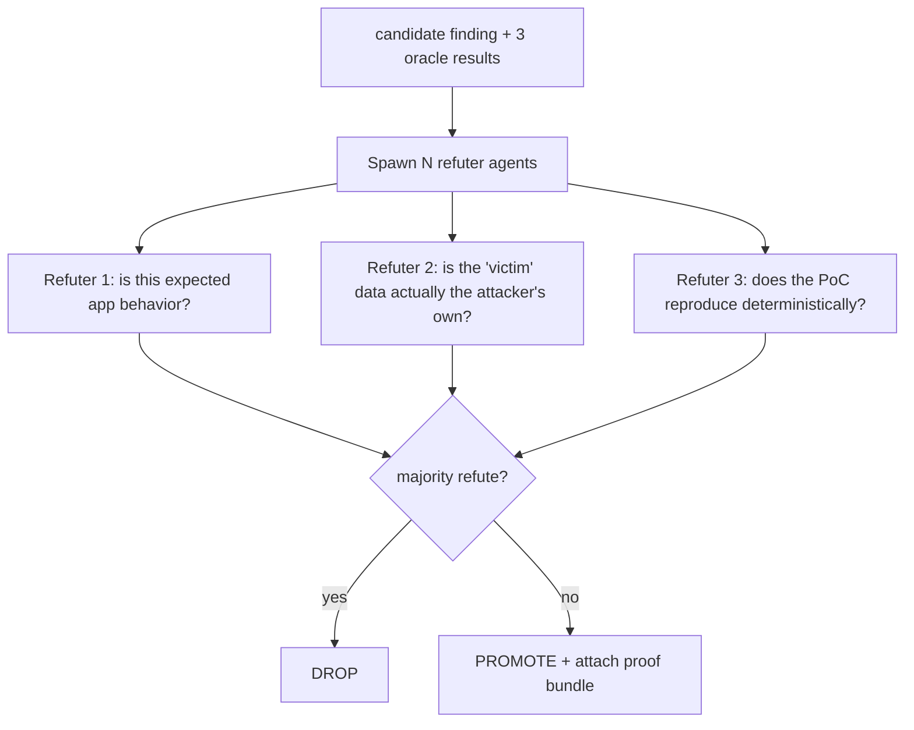

# 03 — The Oracle (the moat)

> If you build only one thing well, build this. Everything else is plumbing.

## The problem it solves

A business-logic bug throws **no error**. The server returns `200 OK`. The response looks normal. So how does an autonomous agent *know* a bug happened?

Naive approach: ask an LLM "is this a vulnerability?" → you get **60-80% false positives** (the exact AI slop that made HackerOne pause the Internet Bug Bounty in 2026). A tool that reports unproven findings is worse than useless — it burns triager trust and buries the real bugs.

**The Oracle is the component that proves an invariant was actually violated.** It is what separates HERETIC from the flood of prompt-an-LLM toys.

## Three stacked oracles

Each test carries an **expected-safe outcome** from Phase 3. The Oracle checks reality against it three independent ways.

### Oracle 1 — Invariant assertion (deterministic, cheapest)
The intent model gives machine-checkable invariants. Compute the expected value, compare to actual.

- INV-2 (price server-side): expected `total == Σ(catalog_price × qty)`. If the response shows `total == client_supplied_price` and it differs → **violated**.
- Deterministic, no LLM, no hallucination. Use wherever the invariant is arithmetic/structural.

### Oracle 2 — Cross-session differential (relational, strong signal)
Fire the **same request as different identities** and diff the results. This is why the multi-session engine exists.

- userA requests userB's `order_id`. If userA (not owner) gets `200` with userB's data, and userB gets the same data → **BOLA confirmed**. The differential *is* the proof.
- Also catches broken function-level auth: `user` role hits an `admin`-only route; diff against the admin's response.

### Oracle 3 — LLM state-delta judge (semantic, for the fuzzy cases)
For invariants that aren't pure arithmetic or access-diff, judge the **state transition**, not the raw response.

- Prompt: *"Before: cart has 1 item, wallet=$50, order not placed. After: order placed, item shipped, wallet=$50. Did any business invariant break?"* → *"Yes: goods obtained without wallet deduction — payment invariant violated."*
- The judge is shown **before/after state**, the **invariant**, and the **expected-safe outcome** — never asked to guess in a vacuum.

## The adversarial gate: refute-or-promote

Even with three oracles, add a final skeptic pass to crush residual false positives. Borrowed from the "Refute-or-Promote" multi-agent methodology.

- Each refuter is prompted to **default to 'this is not a bug'** and must be convinced otherwise. Skeptical bias is intentional — false negatives are cheaper than false positives here.
- A finding is only promoted if it **survives** refutation AND has a **reproducible PoC**.

## Proof bundle (what a confirmed finding must carry)

No finding reaches the report without:
1. The **invariant** it violates (`INV-1: order readable only by owner`).
2. The **expected-safe outcome** vs the **observed outcome**.
3. Which **oracle(s)** fired and their evidence.
4. A **reproducible PoC**: exact ordered requests, which identity sent each, the telltale response.
5. A **re-run confirmation**: the PoC was replayed and reproduced.

## Success metric

The Oracle's whole job is one number: **false-positive rate**. Target: **< 10%** on known targets (crAPI, Juice Shop) while still catching the documented logic bugs (recall). Track precision/recall against ground truth every build — this is the benchmark that decides whether HERETIC is real.

## Anti-patterns (do NOT do)

- ❌ Report anything on a single LLM "looks vulnerable" with no differential/assertion.
- ❌ Treat a `500` error as a logic bug (that's a crash, different class).
- ❌ Confuse "attacker sees their own data" with IDOR (Oracle 2 refuter must rule this out).
- ❌ Skip the re-run confirmation — non-reproducible = not a finding.
